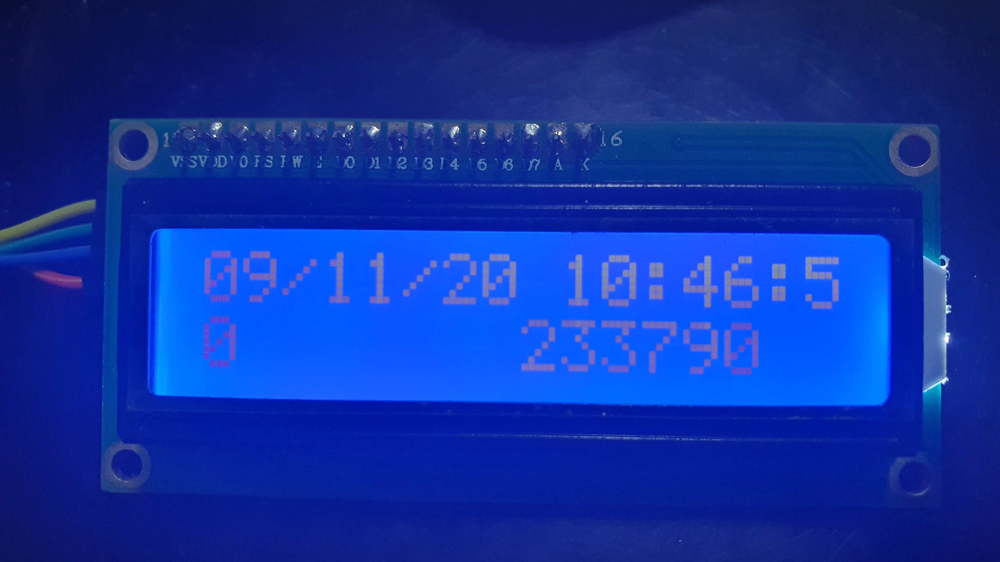

# STACK 2020: IOT RSA Challenge

*The solution presented is the one used by Sig0ct to solve the IOT RSA challenge during STACK 2020, the only university-category team to do so.*

## *Overview*

#### The Challenge

This challenge revolves around reverse-engineering an RSA SecurID token. We are given pictures of the actual hardware token's setup, a .logicdata file containing the signals being sent to the token's LCD display, as well as a text file containing the "key".

Our task is to figure out the username and password, then generate the 2FA token required to log into this [page](http://yhi8bpzolrog3yw17fe0wlwrnwllnhic.alttablabs.sg:40551/).

#### Our Solution

From the information provided, we know that the solution will (at least) require us to:

- Recover/reproduce the information displayed on the token's LCD, by reversing the .logicdata file
- Generate the token, password, and username, using the key provided, plus any new information we have gained.

## *Recovering Token Display*

#### Display Components and I2C


The image provided with the challenge reveals that the token is made of 2 components: 16x2 LCD (top), and a PCF8574T IO Expander (black PCB below). The probes used to capture the .logicdata file are attached to the "SDA" and "SCL" input pins of the IO Expander. We can immediately infer that:

- The captured signal follows the I2C protocol (2 pins, SDA for data and SCL for clock)
- When bytes are sent to the display through I2C, the expander([datasheet](https://www.nxp.com/docs/en/data-sheet/PCF8574_PCF8574A.pdf)) converts each byte into an 8-pin digital output

The question then arises: If the expander only has 8 pins of output, how does it control all 16 pins on the LCD?

The answer is that it doesn't. From the LCD's [datasheet](https://cdn-shop.adafruit.com/datasheets/TC1602A-01T.pdf), we can see that it can operate in 2 modes: 4-bit and 8-bit. In the former, D0-D3 are disconnected, with the LCD receiving instructions through D4-D7, as well as through the RS, RW, E, and A pins. The remaining 4 pins (VSS, VDD, D0, K), used for supplying power to the LCD, are kept fixed. This [schematic](https://image.dfrobot.com/image/data/DFR0063/DFR0063_v1.2_Schematic.pdf) of a similar product suggests that the LCD is indeed running in 4-bit mode.

Here, the mapping between I2C bits and the pins is also important. The schematic, as well as our tests, reveal that the order of the pins is:

LSB													MSB

RS	RW	E	A	D4	D5	D6	D7

This, combined with the instruction mapping available in the LCD's datasheet (and also on [Wikipedia](https://en.wikipedia.org/wiki/Hitachi_HD44780_LCD_controller)), should be enough for us to write some software that takes decoded I2C writes (which we can obtain from .logicdata files using a [logic analyzer](https://www.saleae.com/downloads/)) as input, and outputs the characters displayed on the LCD. This is probably the best solution, right? I mean, what kind of nutcase would want to deal with all the hardware issues and painful debuggi-

 

#### The Fast, Dirty Method: Solving with Hardware

It turns out that the hardware solution is actually much faster, and simpler, to implement. Those are words that I'd never thought I'd actually say, but it's true! The setup only requires a 16x2 LCD and a PCF8574T, which are *very* common (they are also, conveniently, often sold together), and a microcontroller (eg. Arduino). Using the hardware to effectively convert I2C signals into display characters not only saves us the trouble of poring over the HD44780 datasheet and painstaking effort of writing a script to decode the instructions *correctly* while keeping track of the LCD's state, but it also means we end up with an actual, physical, RSA token we can show to our friends, if we had any. I don't know about you, but I like to [*touch* my CTF solutions](https://www.youtube.com/watch?v=5TFDG-y-EHs), so this was the method we used.

###### The Setup

The goal here is to convert the I2C signals that we are given, and produce human-readable characters on the LCD display. 

To accomplish this, we first decode the raw logic signals using our logic analyzer, which gives us a sequence of I2C write commands stored on our computer. We then feed the commands over USB to an Arduino, which then performs the actual writes to the I2C connection with the IO expander. The rest is handled by the hardware.

This setup has the advantage of making use of publicly available, easy-to-use libraries to do most of our work, which dramatically cuts down the time required.

###### Computer to Arduino

The raw output of our logic analyzer (Saleae Logic Analyzer v1) looks like this:

```
Time [s],Packet ID,Address,Data,Read/Write,ACK/NAK
1.396227940000000,1,N,'0',Write,ACK
1.496450310000000,2,N,4,Write,ACK
1.496679830000000,3,N,0,Write,ACK
1.501438270000000,4,N,4,Write,ACK
1.501667660000000,5,N,0,Write,ACK
...
```

Here, we only need the "Data" column - the timing is not important for writing to the LCD; all the commands are writes to the same address; and ACK/NAK is an acknowledge signal to be written by the IO expander, not the Arduino. However, there is a small complication: for some inexplicable reason, analyzer formats the "Data" column in the most inconvenient way possible, so we have to process it. Here `'0'` refers to 0x00 byte, while `0` refers to the ASCII character 0 (0x30). The script used is shown below: (for the rest of the code see `utility.py`)

```python
def convertStr(string):
    # Where the magic happens - this is called on each line of the input text file
    # Converts poorly formatted string into nice integers so that we can feed it to arduino
    if(string=="' '"): # WHY
        return 32
    elif(string=="COMMA"): # IS
        return 44
    elif(string[0]=="'"): # FORMATTING
        return int(string.strip(string[0]))
    elif(string=="\\r"): # SO 
        return 13
    elif(string=="\\t"): # BAD
        return 9
    else:
        return ord(string)

# Loading analyzer output
dir=os.getcwd()
path=os.path.join(dir,"decoded_i2c.txt")
outPath=os.path.join(dir,"processed.csv")
in_data=pd.read_csv(path,sep=',')

# Processing data
vectConvert=np.vectorize(convertStr,otypes=[np.int32])
data_np=vectConvert(in_data["Data"].to_numpy())
print(data_np)

# Saving result
np.savetxt(outPath,data_np,fmt="%i",delimiter="\t")
```

Which gives us a consistent format where each line contains the decimal value of the byte to be sent over I2C:

```
0
52
48
52
48
...
```

This is then sent to the Arduino with the following script: (see `utility.py`)

```python
class sender():
    # For sending stuff to arduino
    def __init__(self,serialPath="/dev/ttyACM0",csvPath="processed.csv"):
        # Opens serial port and loads data from file
        self.serObj=serial.Serial(serialPath,9600)
        self.data=np.genfromtxt(os.path.join(os.getcwd(),csvPath),dtype=np.int32)
        self.index=0
        print(self.data)

    def send_a_bunch(self,n):
        # Sends n lines of data to Arduino
        startIndex=self.index
        for i in range(n):
            toSend=self.data[startIndex+i]
            toSend=(str(toSend)+"\n")
            print(toSend)
            self.serObj.write(toSend.encode())
            self.index+=1
            # Some delay is necessary to let the LCD respond
            time.sleep(0.1)
```

###### Arduino to LCD 

The Arduino then receives the data, and for each line it receives, sends the appropriate byte over I2C (see `iot-5.ino`) using Arduino's Wire library. Crucially, we have to first initialize the LCD display using the proper library (shown below). This is especially important because we want to use the display in 4-bit mode rather than the display's default 8-bit mode, and we don't know whether the decoded I2C contains the instructions to do so (and other instructions needed for proper initialization). In any case, there isn't any harm in initializing the display twice.

```c
#include <Wire.h>
#include <LiquidCrystal_I2C.h>

LiquidCrystal_I2C lcd(0x27,16,2);

void setup() {
  // initializes lcd and opens serial port
  Serial.begin(9600);
  lcd.init(); // sends instructions to use 4-bit mode, among other things
  lcd.backlight();
  delay(500);
  lcd.clear();
}
```

###### The Result

Putting everything together, we see a beautiful sight: hardware that actually works as intended, instead of short-circuiting everywhere and blowing up. The LCD displays several screens worth of information, all of which (except the first - which doesn't have anything important) is shown below:





## *Generating Tokens*

Now that we have the username and password, all that's left is to generate the 2FA tokens. Given that we already know the key, and that the physical token has so kindly given us 4 examples, this should be trivial, right?

#### It Was Not Trivial

The algorithm used to generate RSA SecurID tokens is proprietary, so it took some digging (Google -> Stackoverflow -> Some obscure forum post) to find anything usable, which in this case was some C code for generating tokens: http://seclists.org/bugtraq/2000/Dec/459 

In short, the RSA tokens use a 64-bit key, and the current time (in the form of a UNIX timestamp) as inputs to a magic hash function that spits out a 12-digit hex value. This hashing is done for every 120-second time period, with the 12-digit hex converted into a pair of 6-digit decimals - one for the 1st 60 seconds, and the other for the next 60 seconds. These 6-digit decimals are the tokens shown to the user, and subsequently used to log in.

After some modifications, we got the code to generate tokens using our key, and we tried to replicate the 4 examples:

```
Timestamp					Unix time	Token
Mon Nov  9 10:42:00 2020	1604889720	461177 <-- part of sequence
Mon Nov  9 10:43:00 2020	1604889720	107307 <-- part of sequence
Mon Nov  9 10:44:00 2020	1604889840	835746
Mon Nov  9 10:45:00 2020	1604889840	193775
Mon Nov  9 10:46:00 2020	1604889960	835746
Mon Nov  9 10:47:00 2020	1604889960	193775
Mon Nov  9 10:48:00 2020	1604890080	233790 <-- part of sequence
Mon Nov  9 10:49:00 2020	1604890080	722277 <-- part of sequence
...
```

There is something disturbing going on here. The sequence of tokens generated by our code does contain the example tokens, but not at the correct times. Specifically, there are a bunch of tokens in our sequence that are not in the example, which causes the 3rd and 4th example tokens to be generated at 7 and 8 minutes after the 1st, rather than 3 and 4 minutes as we would expect.  

#### The Fast Way

After playing around with code for a while, we made an interesting observation: 

***Several of the 6-digit tokens kept appearing over and over again, even when the timestamp changed by months.***

How frequently? To find out, we generated every token within a ~1 month window, and tallied up the number of times each unique token appeared (see `keygen-brute.cpp`). The assumption here is, of course, that the distribution of tokens in the real sequence is similar to the distribution in our generated sequence. If this assumption holds, rather than spending hours and hours *ahem* figuring out the problem and perfectly replicating the RSA token's behavior, we can just try the most frequently occurring 6-digit codes, perhaps using a script. 

If we do brute-force the logins, however, we can be more efficient by only generating half the tokens. This is because the tokens are generated in pairs for every 120s window, and the login server provides some leeway if the (physical) token's clock is slightly out of sync with the server's. This means that:

- The frequency of the 2nd token is strongly correlated with the frequency of the 1st
- If the 2nd token in a pair is accepted, the 1st one will probably be accepted as well 

Which means that we can probably get away with generating only the 1st token in each pair, and tallying their frequencies. The results are shown below (first column is 6-digit token, second is frequency):

```
Generating tokens between:
Mon Nov  9 08:42:00 2020
Thu Dec 10 18:02:17 2020
Total tokens generated:		22601
Number of unique tokens:	464
835746	6082
997494	1208
578454	1142
461177	1044
233790	962
...
```

Out of 22601 tokens generated in total, only 464 are unique, which means that an automated dictionary-attack that iterates over the 464 tokens wouldn't take very long. But it gets better (for us) - the top 5 most common tokens alone account for nearly half the tokens, which means trying those 5 already gives us a very good chance of getting in! 

Just out of curiosity, I also plotted the CDF of the N most common keys:


From this graph, we can see that N=10 has a ~55% success rate, with diminishing returns thereafter: N=40 gives a ~80% rate, while N=100 increases it to ~90%. 

At this point, we could still try an automated attack and iterate through all the tokens in our list, but why bother? Manually trying the top 5 keys already has a ~50% success rate (even "8935746" alone has a ~25% chance), and if those don't work, we can try again every 2 minutes anyways!


#### Dead-Ends

Because the "fast way" was unlikely to be the intended solution method, we also tried a number of other solutions, none of which worked. They are described below, because ~~I'm a masochist and like to relive the pain of laboring over this problem~~ I believe finding out what *doesn't* work is just as important for understanding the problem as finding out what does.

###### Skipping Codes

At first, it seemed like the example token was just skipping several of the 6-digit codes, so we tried to reproduce this "skipping" behavior by advancing the current time (supplied by the system's clock) to what we believed was the token's time:

```c
unsigned long convert_time(signed long t){
    signed long t0=1604889720;
    return ( ((t-t0)/120)*3*120 ) + t0; // also tried ( ((t-t0)/120)*4*120 ) + t0
}
```

###### Scanning

The other possibility was that there was a large offset between the time displayed on the LCD and the time it used internally to generate the tokens. So, we generated tokens, in sequence, within ±2 hours of the displayed time, and searched for instances where the 4 example tokens were found consecutively. We did find 2 matches (shown below), and for each of these tried correcting the offsets to generate up-to-date tokens. Unfortunately, the tokens didn't work.

```
...
Mon Nov  9 11:53:00 2020	1604893920	722277
Mon Nov  9 11:54:00 2020	1604894040	461177 <-- Match 1
Mon Nov  9 11:55:00 2020	1604894040	107307 <--
Mon Nov  9 11:56:00 2020	1604894160	233790 <--
Mon Nov  9 11:57:00 2020	1604894160	722277 <--
Mon Nov  9 11:58:00 2020	1604894280	835746
...
Mon Nov  9 12:21:00 2020	1604895600	107307
Mon Nov  9 12:22:00 2020	1604895720	461177 <-- Match 2
Mon Nov  9 12:23:00 2020	1604895720	107307 <--
Mon Nov  9 12:24:00 2020	1604895840	233790 <--
Mon Nov  9 12:25:00 2020	1604895840	722277 <--
Mon Nov  9 12:26:00 2020	1604895960	835746
...
```

## *Conclusion*

All told, the amount of time spent on each part of this challenge looked something like this:

| Part of Challenge                             | Approximate Time Spent |
| --------------------------------------------- | ---------------------- |
| Recovering display (incl. reading datasheets) | 6h                     |
| Generating tokens                             | 8h                     |
| Pain and anguish                              | 14h                    |

Because this is my first time solving an IoT CTF challenge, it took quite some time to figure out the I2C protocol, and to download and install tools like the logic analyzer. A lot of time was also spent thinking through my intended solution (building a physical token), and figuring out if there were any serious problems that I might face later, which would force me to use a different approach (and waste the time I would've spent on this one). I was also stuck trying to generate tokens perfectly for quite some time, debugging the code and trying different solutions. It also didn't help that I had doubts about whether my solution thus far was correct. In hindsight, I probably should have had more confidence, given that the results so far were perfectly logical and consistent.

As for the "intended" solution, [it turns out](https://github.com/qihaoooooo/ctf-writeups/blob/master/stack-2020/iot-challenge-5/writeup/writeup.md) that we were supposed to use a different epoch (see the "question of the day" that the LCD displays) than the one in the code we found online. I did notice the magic-number epoch, and (briefly) tried substituting the GovTech date, but for some reason it didn't work. Given that none of my solutions actually used the "question of the day", it would probably have been a good idea to spend more time debugging the epoch solution, since the "question of the day" was very likely to be something important.

Considering that it's one of my first CTFs, there is definitely quite a lot that can be improved with more experience. That being said, this challenge also turned out much better than I expected, considering its difficulty and the complications we faced.

All in all, I had a lot of fun with this, and being the only team to solve the challenge within the 48hr window was certainly very satisfying too.
